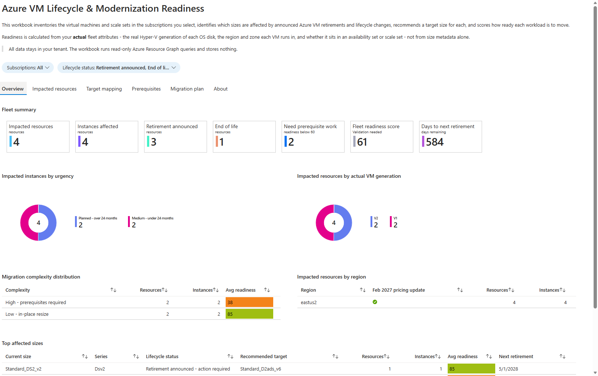
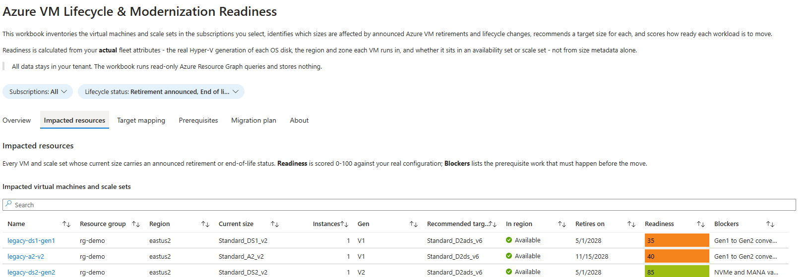
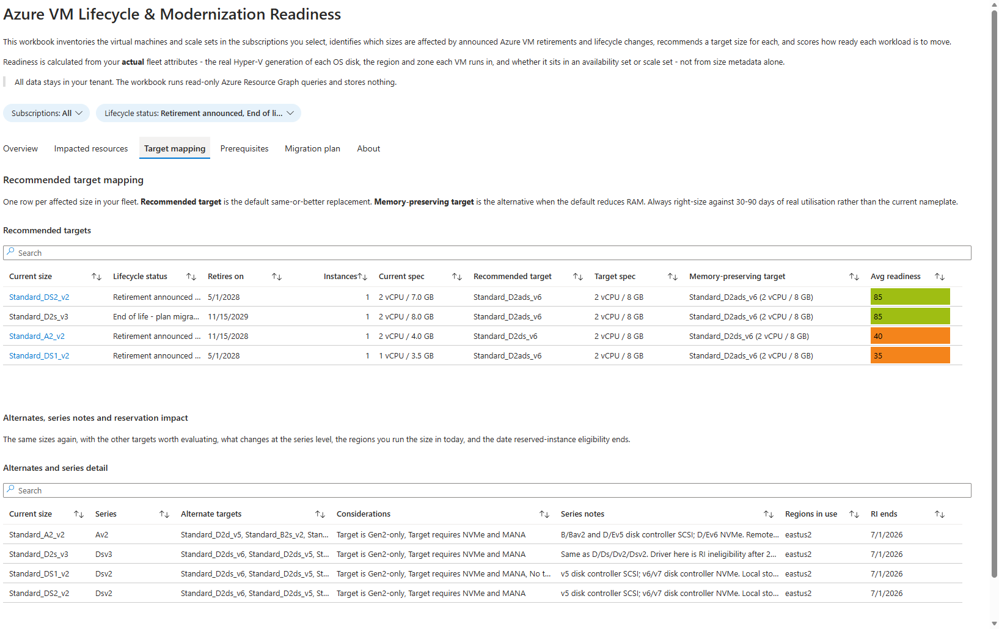
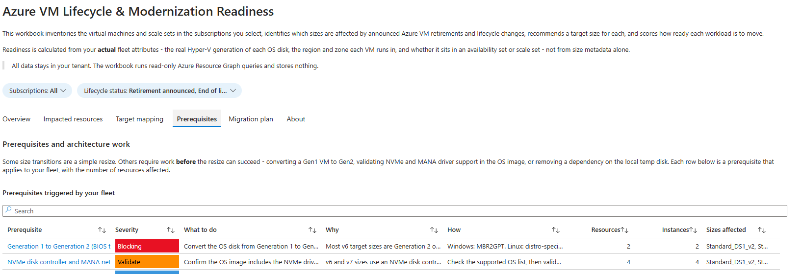
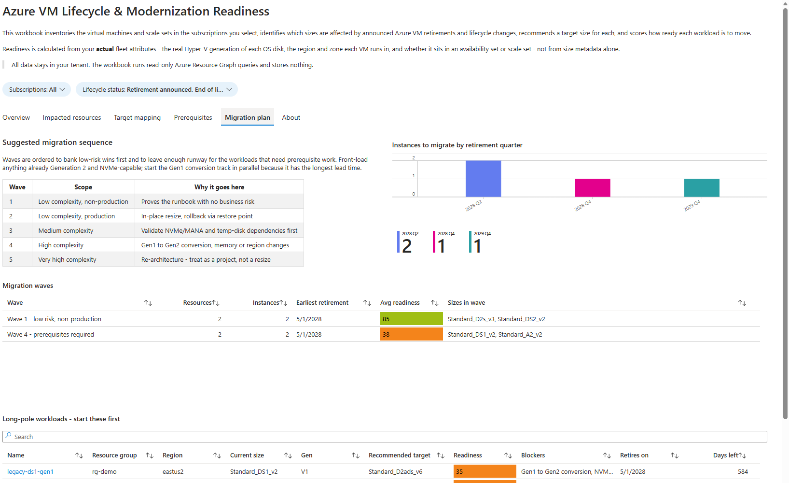
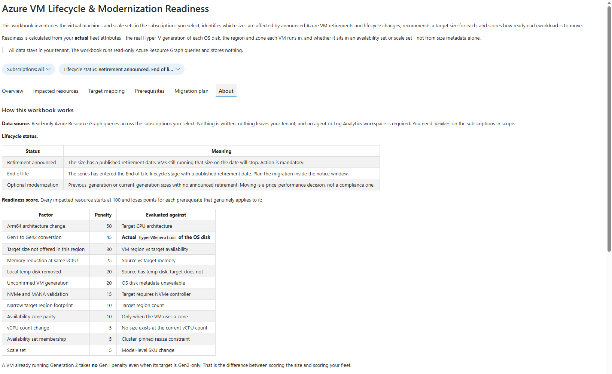

# Azure VM Lifecycle & Modernization Readiness Workbook

[](https://opensource.org/licenses/MIT)

A customer-deployable Azure Monitor Workbook that inventories a customer's VM fleet,
flags every size affected by announced Azure VM retirements and lifecycle changes,
recommends a target size for each, scores migration readiness against the fleet's
**actual** configuration, and lists the prerequisite work each move requires.

Modelled on the Azure Advisor *Service Retirement* workbook, but VM-specific and
with target mapping plus readiness scoring that Advisor does not provide.

[](https://portal.azure.com/#create/Microsoft.Template/uri/https%3A%2F%2Fraw.githubusercontent.com%2Fkrishna-sunkavalli%2Fvm-retirement-workbook%2Fmain%2Fworkbook%2Fazuredeploy.json)



<sub>Screenshots are from a four-VM demo tenant built to exercise the scoring: two
Gen1 VMs, one Gen2 VM and one v3 end-of-life VM.</sub>

---

## What the customer gets

| Tab | Contents |
| --- | --- |
| **Overview** | Fleet summary tiles (impacted resources, instances, retirement vs end-of-life split, count needing prerequisite work, fleet readiness score, days to next retirement), urgency and actual-VM-generation donuts, complexity breakdown, commercial impact (pricing update and Reserved Instance status), top affected sizes |
| **Impacted resources** | Every affected VM and scale set with region, actual Hyper-V generation, recommended target, target region availability, readiness score and named blockers. The resource name deep-links to the resource |
| **Target mapping** | Two grids. *Recommended targets*: current spec, recommended target, memory-preserving alternative, retirement date — the size name links to the announcement. *Alternates, series detail and commercial impact*: up to three alternates, size-level considerations, series spec deltas, whether the 1 Feb 2027 pricing update applies, and when Reserved Instance coverage ends |
| **Prerequisites** | Prerequisites triggered by *this* fleet, ranked Blocking / Validate / Plan, with what to do, why it matters, how to do it and a docs link, plus the count of affected resources and the sizes involved |
| **Migration plan** | Five suggested waves, a burn-down by retirement quarter, and the long-pole workloads to start first |
| **About** | Methodology, the full readiness scoring table, caveats and references |

### Impacted resources

Sorted worst-readiness first, so the workloads that need the most lead time are at
the top. Note the two Gen1 VMs scoring 35 and 40 against the Gen2 VM at 85 — same
retirement, very different amount of work.



### Target mapping

`Standard_DS1_v2` is 1 vCPU / 3.5 GB and its recommended target is 2 vCPU / 8 GB —
the kind of spec jump that changes per-core licensing, which is why the current and
target specs sit side by side.



### Prerequisites

Only the prerequisites that *this* fleet actually triggers, ranked Blocking first.
The Gen1-to-Gen2 conversion is the long pole and is surfaced as blocking.



### Migration plan



### About



## Why the readiness score is meaningful

Most retirement tooling scores the **size**. This scores the **fleet**.

The workbook joins each VM to its managed OS disk and reads the real
`properties.hyperVGeneration`. A VM already running Generation 2 takes **no** Gen1
penalty even when its recommended target is Gen2-only, while a Gen1 VM heading for
the same target takes a 45-point hit and surfaces the BIOS-to-UEFI conversion as a
blocking prerequisite.

Validated against a live fleet: identical `RETIRE` sizes scored **95** on Gen2 VMs
and **35** on Gen1 VMs.

| Factor | Penalty | Evaluated against |
| --- | ---: | --- |
| Arm64 architecture change | 50 | Target CPU architecture |
| Gen1 to Gen2 conversion | 45 | Actual `hyperVGeneration` of the OS disk |
| Target size not offered in this region | 30 | VM region vs captured size catalogue |
| Memory reduction at same vCPU | 25 | Source vs target memory |
| Local temp disk removed | 20 | Source has temp disk, target does not |
| Unconfirmed VM generation | 20 | OS disk metadata unreadable |
| NVMe and MANA validation | 15 | Target requires NVMe controller |
| Narrow target region footprint | 10 | Target region count |
| Availability zone parity | 10 | Only when the VM uses a zone |
| vCPU count change | 5 | No target at the current vCPU count |
| Availability set membership | 5 | Cluster-pinned resize constraint |
| Scale set | 5 | Model-level SKU change |

Bands: 85+ in-place resize, 60-84 validate then resize, 35-59 prerequisites
required, under 35 re-architecture.

---

## Resources vs instances
The two counts differ wherever a scale set is involved:

- **Resources** counts ARM objects. A scale set is one resource however large it is.
- **Instances** counts actual VMs. A scale set contributes `sku.capacity`.

A fleet of 12 resources and 400 instances means twelve pieces of work but four
hundred machines rebooting. Effort and change control size off Resources; quota,
cost and blast radius size off Instances.

### Flexible orchestration is counted once

A **Flexible** scale set surfaces in Azure Resource Graph twice over: the scale
set itself, carrying `sku.capacity`, *and* every member VM as its own
`microsoft.compute/virtualmachines` row. Counting both double-reports the fleet -
a 2-instance scale set reads as 3 resources and 4 instances.

The base query drops member VMs and lets the scale set represent them:

```kusto
| where IsVmss or isempty(tostring(properties.virtualMachineScaleSet.id))
```

**Uniform** scale sets never expose member VMs, so they were always counted
correctly. Flexible is the current Azure default, so this affects most modern
fleets.

---

## How environment is determined

Wave 1 is the no-risk pilot, so it only accepts workloads confirmed to be
non-production. Most fleets do not tag every VM, so environment is resolved
through a cascade and the workbook reports which signal it used:

| Order | Signal | Notes |
| ---: | --- | --- |
| 1 | Resource tag | `Environment`, `Env`, `Tier`, `Stage` or `Usage`, any casing |
| 2 | Resource group tag | Same keys on the parent resource group |
| 3 | Subscription tag | Same keys on the subscription |
| 4 | Dev/Test subscription offer | A Visual Studio or Enterprise Dev/Test subscription cannot host production under the Azure offer terms |
| 5 | Naming convention | `dev`, `test`, `qa`, `uat`, `sandbox`, `staging` in the subscription or resource group name. Read only as non-production, never as production, because a name is weaker evidence than a tag |

Values are normalised, so `non-prod`, `non_prod` and `nonprod` read alike.

**Anything the cascade cannot resolve is sequenced as production.** Guessing the
other way puts a production VM into a wave the customer was told carries no
business risk.

If a fleet has no environment signal at all, every low-complexity workload lands
in wave 2 and wave 1 is empty - which is the correct outcome, not a bug. One
`Environment` tag per resource group resolves the whole estate through step 2.

The **Environment** and **Signal** columns on the wave table show the verdict and
its source, so the classification is auditable rather than implicit.

### Worked example

A four-VM demo fleet where the resource group carries `Environment=Development`
and two VMs carry their own tag:

| VM | Own tag | Resolved | Signal |
| --- | --- | --- | --- |
| `legacy-ds2-gen2` | `Environment: Production` | Production | Resource tag |
| `legacy-d2s-v3` | `Environment: non-prod` | Non-production | Resource tag |
| `legacy-ds1-gen1` | *none* | Non-production | Resource group tag |
| `legacy-vmss-ds2v2` | *none* | Non-production | Resource group tag |

A resource tag always beats the group it sits in, and the two untagged VMs
inherit the group rather than falling through to *Unverified*.

### Why not just search the tags

An earlier version tested `tostring(Tags) has 'prod'`. That is wrong in both
directions, because KQL `has` matches whole terms:

| Tag | Old verdict | Why |
| --- | --- | --- |
| `Environment: Production` | Non-production | `"Production"` is not the term `"prod"` |
| `Environment: non-prod` | Production | tokenises to `[non, prod]` |
| `Product: prod-catalog` | Production | matched an unrelated tag |

The first row is the dangerous one: a production VM sequenced into wave 1.

---

## The queries

Every Azure Resource Graph query the workbook runs is documented verbatim in
[`docs/QUERIES.md`](docs/QUERIES.md) - 15 read-only queries, with the shared base
pipeline shown once and each per-tab tail alongside it. Nothing is hidden: you
can audit exactly what executes against your tenant before you deploy.

## Sharing the results

| Need | How |
| --- | --- |
| **Export a table to Excel** | Detail grids carry a **Download to Excel** toolbar button. It exports *all* columns, not just the visible ones, so the prose columns that truncate on screen come through in full. |
| **Print / PDF** | Workbooks have no native print command. Use the browser's own **Print → Save as PDF** (`Ctrl+P`). Expand the tab you want first; only the visible tab prints, because the other tabs are hidden by conditional visibility. |
| **Share the live view** | The toolbar **Share** button copies a URL that carries your parameter selections. The recipient needs `Reader` on the same subscriptions. |
| **Pin to a dashboard** | Individual charts and grids can be pinned to an Azure dashboard from the item's **Pin** control. |

There is no built-in "export the whole workbook to PDF" - that is a long-standing
Workbooks gap rather than something this workbook can add. For a point-in-time
artifact to send to a customer, the Excel export per grid is the reliable path.

---

## Deploying it

### Option A - Deploy to Azure (recommended)

[](https://portal.azure.com/#create/Microsoft.Template/uri/https%3A%2F%2Fraw.githubusercontent.com%2Fkrishna-sunkavalli%2Fvm-retirement-workbook%2Fmain%2Fworkbook%2Fazuredeploy.json)

Pick a subscription and resource group, then **Review + create**. The workbook
appears under **Monitor → Workbooks**.

### Option B - Azure CLI

```bash
az group create --name rg-vm-lifecycle --location eastus

az deployment group create \
  --resource-group rg-vm-lifecycle \
  --template-file workbook/azuredeploy.json \
  --parameters workbookDisplayName="Azure VM Lifecycle & Modernization Readiness"
```

### Option C - Azure PowerShell

```powershell
New-AzResourceGroup -Name "rg-vm-lifecycle" -Location "eastus"

New-AzResourceGroupDeployment `
  -ResourceGroupName "rg-vm-lifecycle" `
  -TemplateFile "workbook/azuredeploy.json" `
  -workbookDisplayName "Azure VM Lifecycle & Modernization Readiness"
```

### Option D - paste the template (no resource created)

1. Azure portal → **Monitor** → **Workbooks** → **New**
2. Click the **</>** *Advanced Editor* button
3. Paste the contents of [`workbook/vm-lifecycle-readiness.workbook`](workbook/vm-lifecycle-readiness.workbook)
4. **Apply** → **Done Editing** → **Save**

### Permissions

`Reader` on every subscription in scope. The workbook issues **read-only** Azure
Resource Graph queries, writes nothing, needs no agent and no Log Analytics
workspace, and no data leaves the tenant.

If a subscription grants read on `virtualMachines` but not on `disks`, the OS-disk
join returns nothing and those VMs show `VmGeneration = Unknown` with a 20-point
penalty and a "Confirm VM generation" prerequisite, rather than failing.

---

## Rebuilding

```bash
python scripts/build_workbook.py      # regenerate workbook + ARM template
python scripts/build_queries_doc.py   # regenerate docs/QUERIES.md
python scripts/validate_queries.py    # structural checks + run all 15 queries live
```

`build_workbook.py` writes four files: the workbook and ARM template under
`out/` for local iteration, and published copies at `workbook/azuredeploy.json`
and `workbook/vm-lifecycle-readiness.workbook`. The published ARM template is
what the **Deploy to Azure** button resolves, so it must be committed for the
button to work.

`validate_queries.py` needs `az login` and the `resource-graph` CLI extension. It
verifies that tab links match group visibility conditions, that every query is
scoped to `{Subscriptions}` and references only declared parameters, and that all
15 Resource Graph queries execute successfully. Azure Resource Graph throttles
aggressive callers, so an occasional single-query failure on a back-to-back run is
a rate limit rather than a regression - re-run to confirm.

### Source data

`references/sku-migration-map.json` is vendored into this repo so a fresh clone
builds without any sibling checkout. It carries 628 sizes - 137 retiring, 39
end-of-life, 452 optional - with targets, memory-preserving alternatives,
alternates and warning codes, and self-declares:

> PUBLIC - all lifecycle facts sourced from learn.microsoft.com. Contains NO
> pre-announcement pricing information.

Prerequisite copy and series lifecycle detail were originally separate reference
files; they are now inlined in `scripts/build_workbook.py` as the `PREREQ` and
series tables. `scripts/build_workbook.py` prefers the local `references/` folder
and falls back to a sibling `compute-fleet-modernization/references` checkout when
building from the authoring tree.

### Implementation notes

Azure Resource Graph supports neither `let` nor `datatable`, so the lifecycle
lookup is embedded in each query as a `parse_json('{...}')` dynamic literal indexed
by VM size. To keep that literal small, warning codes are stored as single
characters and region lists as hex indices into a shared region table, which cut
the generated workbook from 3.5 MB to ~1.2 MB.

### Layout conventions

Modelled on the official Advisor *Azure Services Retirement* workbook
(`reference/official-service-retirement.workbook`):

- **Column widths are percentages**, not `ch`. Each grid's widths sum to 100 so
  the table fits the container instead of scrolling horizontally.
- **Workbooks enforces a ~130px minimum column width**, so any percentage below
  about 8% of a full-width grid is silently floored. The practical limit on a
  1600px canvas is **11-12 columns**; past that the grid scrolls sideways and the
  scrollbar eats the row height. Cut columns rather than shrinking percentages.
- **Query `size` sets the grid height**, and `gridSettings.rowLimit` only caps how
  many rows the query returns - it does not make the grid taller. Measured
  heights: `size: 4` ~126px (3 rows, too cramped), `size: 1` ~220px (~6 rows,
  the balance used here), `size: 2` ~600px (~18 rows, leaves dead space under
  short results).
- **Static dropdowns use `jsonData`**, not `query` + `queryType: 8`. The latter
  never resolves and leaves every dependent query showing *"This query could not
  run because some parameters are not set."*
- **Date columns** carry `dateFormat: {showUtcTime, formatName: shortDatePattern}`,
  otherwise they render as `4/30/2028, 7:00:00 AM`.
- **Resource and URL links** use formatter 1 with `linkColumn` pointing at a
  companion column that is itself hidden with formatter 5. That makes the resource
  name or size name the clickable element and removes a redundant link column.
- **Numeric columns carry no bar formatter.** Formatter 4 renders a left-aligned
  value with a coloured bar while plain numbers right-align, so mixing the two
  across `Resources` and `Instances` made the columns look misaligned. Only the
  readiness heat map (formatter 8, `redGreen`) keeps a colour treatment.

---

## Classification

**Customer-facing. Public facts only.**

Included: announced retirement dates and migration targets; the v3
(Dv3/Dsv3/Ev3/Esv3) End-of-Life status with its 15 November 2029 retirement date;
a neutral flag naming the size series in scope for the 1 February 2027 pricing
update; and the Reserved Instance purchase and renewal end date of 1 July 2026
([Azure update 560948](https://azure.microsoft.com/updates?id=560948)).

Deliberately excluded: the rate-change percentage. The increase is scoped by
size series, and the applicable figures reach each customer through their own
Azure Service Health notification and depend on their agreement. Restating a
single percentage in a template deployed into arbitrary tenants would be a
generalized bill-impact claim, so the workbook flags *which* series are in scope
and points at the official
[Windows](https://azure.microsoft.com/pricing/details/virtual-machines/windows/)
and [Linux](https://azure.microsoft.com/pricing/details/virtual-machines/linux/)
VM pricing pages for rates. Internal field and partner collateral is likewise
excluded.

The v3 retirement and the lifecycle policy became public on **28 September 2026**
via the [Azure blog](https://azure.microsoft.com/blog/enhancing-microsoft-azure-virtual-machine-lifecycle/)
and the Learn lifecycle pages.

### Cloud coverage

The retirement and the pricing update do not share the same scope:

| | Azure public | 21Vianet | Sovereign / Government |
| --- | :---: | :---: | :---: |
| v3 retirement | Applies | Exempt | Exempt |
| 1 Feb 2027 pricing update | Applies | Applies | Exempt |

The workbook does not detect cloud type; the About tab carries this table so a
reader in a sovereign or government tenant can discount the flags.
